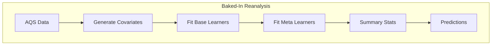

# Near Real Time Air Pollution Model 
## Group Project for the Spatiotemporal Exposures and Toxicology group with help from friends :smiley:

## Overall Project Workflow

## Integrating Unit and Integration Testing 

We will utilize various testing approaches to ensure functionality and quality of code

