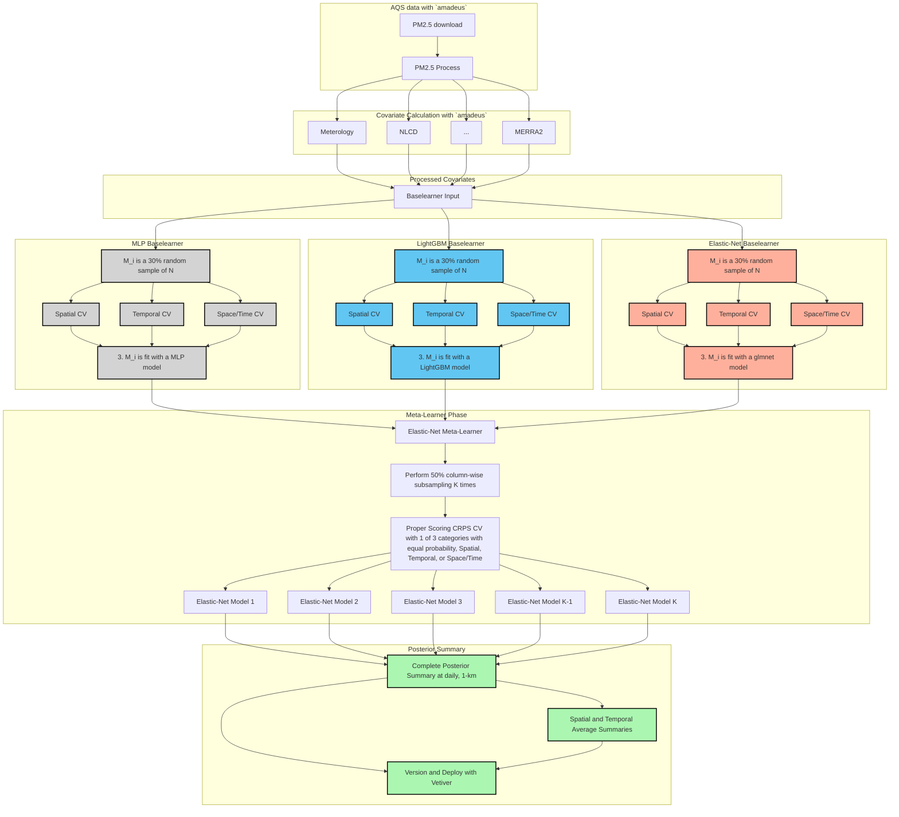
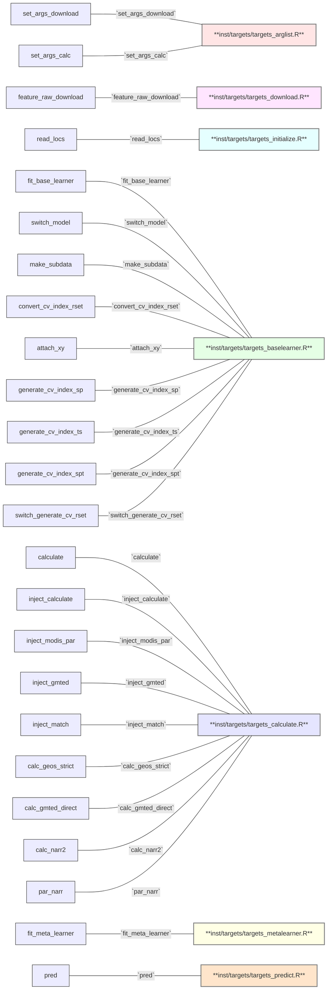

# Building an Extensible, rEproducible, Test-driven, Harmonized, Open-source, Versioned, ENsemble model for air quality <a href="https://niehs.github.io/beethoven"><a>


<p>
 
[](https://github.com/NIEHS/beethoven/actions/workflows/check-standard.yaml)
[](https://github.com/NIEHS/beethoven/actions/workflows/test-coverage.yaml)
[](https://github.com/NIEHS/beethoven/actions/workflows/lint.yaml)
[](https://lifecycle.r-lib.org/articles/stages.html#experimental)


Group Project for the Spatiotemporal Exposures and Toxicology group with help from friends :smiley: :cowboy_hat_face: :earth_americas: 


</p>
    
## Installation

```r
remotes::install_github("NIEHS/beethoven")
```

## Overall Project Workflow

Targets: Make-like Reproducible Analysis Pipeline
 1) AQS Data
 2) Generate Covariates
 3) Fit Base Learners
 4) Fit Meta Learners
 5) Predictions
 6) Summary Stats


 
**Placeholder for up-to-date rendering of targets**

```r
tar_visnetwork(targets)
```
    

## Project Organization

Here, we describe the structure of the project and the naming conventions used. The most up to date file paths and names are recorded here for reference.

### File Structure

#### Folder Structure

- `R/` This is where the main R code (e.g. .R files) lives. Nothing else but .R files should be in here. i.e. Target helper functions, model fitting and post-processing, plotting and summary functions. 
- `tests/` This is where the unit and integration tests reside. The structure is based off the standard practices of the [testthat](https://testthat.r-lib.org/) R package for unit testing.
    - `testthat` Unit and integration tests for CI/CD reside here
    - `testdata` Small test datasets including our small (in size) complete pipeline testing. 
    - `testthat.R` Special script created and maintained by testthat
- `man/` This sub-directory contains .Rd and othe files created by the [roxygen2](https://roxygen2.r-lib.org/) package for assisted documentation of R packages
- `vignettes/` Rmd (and potentially Qmd) narrative text and code files. These are rendered into the **Articles** for the package website created by [pkgdown](https://pkgdown.r-lib.org/) 
- `inst/` Is a sub-directory for arbitrary files outside of the main `R/` directory
     - `targets` which include the important pipeline file `_targets.R`
- `.github/workflows/` This hidden directory is where the GitHub CI/CD yaml files reside

##### The following sub-directories are not including the package build and included only in the source code here
- `tools/` This sub-directory is dedicated to educational or demonstration material (e.g. Rshiny).
  
#### Relevant files 

- LICENSE
- DESCRIPTION
- NAMESPACE 
- README.md

### Naming Conventions

Naming things is hard and somewhat subjective. Nonetheless, consistent naming conventions make for better reproducibility, interpretability, and future extensibility. 
Here, we provide the `beethoven` naming conventions for objects as used in `targets` and for naming functions within the package (i.e. **R/**). 
For `tar_target` functions, we use the following naming conventions:


Naming conventions for `targets` objects. We are motivated by the [Compositional Forecast](https://cfconventions.org/Data/cf-standard-names/docs/guidelines.html) (CF) model naming conventions:

e.g. [surface] [component] standard_name [at surface] [in medium] [due to process] [assuming condition]
In CF, the entire process can be known from the required and optional naming pieces. 

Here, we use the following naming convention:

**[R object type]\_[role-suffix]\_[stage]\_[source]\_[spacetime]**

 Each section is in the brackets [] and appears in this order. For some objects, not all naming sections are required. If two keywords in a section apply, then they are appended with a `-`

Examples: 1) `sf_PM25_log10-fit_AQS_siteid` is an `sf` object for `PM25` data that is log-transformed and ready for base-learner fitting, derived from AQS data and located at the siteid locations. 
2) `SpatRast_process_MODIS` is a terra `SpatRast` object that has been processed from MODIS.


#### Naming section definitions:

- **R object type**: chr (character), list, sf, dt (datatable), tibble, SpatRaster, SpatVector

- **role:** Detailed description of the role of the object in the pipeline. Allowable keywords:

  - PM25
  - feat (feature) (i.e. geographic covariate) 
  - base_model
    - base_model suffix types: linear, random_forest, lgb (lightGBM), xgb (xgboost), mlp (neural network, multilayer perceptron) etc.
  - meta_model 
  - prediction
  - plot
    -plot suffix types: scatter, map, time_series, histogram, density etc. 
  
- **stage**: the stage of the pipeline the object is used in. Object transformations
are also articulated here. Allowable keywords: 

  - raw
  - calc: results from processing-calculation chains
  - fit: Ready for base/meta learner fitting
  - result: Final result
  - log
  - log10 

- **source:** the original data source

  - AQS
  - MODIS
  - GMTED 
  - NLCD
  - NARR
  - GEOSCF
  - TRI
  - NEI
  - KOPPENGEIGER
  - HMS
  - gROADS
  - POPULATION
  - [Note, we can add and/or update these sources as needed] 

- **spacetime:** relevant spatial or temporal information 

  - spatial: 
    - siteid
    - censustract
    - grid
  - time: 
    - daily  [optional YYYYMMDD]
    - annual  [optional YYYY]


### Function Naming Convenctions 

We have adopted naming conventions in functions in this package as well as `amadeus` which is a key input package. 

**[High-Level-Process]\_[Source]\_[Object]**

- **High-Level-Process**
     - download
     - process
     - calc

- **source:** the original data source. Same as source section for tar objects

- **Object** An object that the function may be acting on
     - base_model (base)
     - meta_model (meta)
     - feature (feat) 


 
### To run the pipeline
#### Post-checkout hook setting
As safeguard measures, we limit the write permission of `_targets.R` to authorized users. To activate post-checkout hook, run `setup_hook.sh` at the project root.

```shell
. setup_hook.sh
```

The write privilege lock is applied immediately. Users will be able to run the pipeline with the static `_targets.R` file to (re-)generate outputs from the pipeline.

#### User settings
`beethoven` pipeline is configured for SLURM with defaults for NIEHS HPC settings. For adapting the settings to users' environment, consult with the documentation of your platform and edit the `_targets.R` and `inst/targets/targets_calculate.R` (i.e., resource management) accordingly.

#### Setting `_targets.R`
For general users, all `targets` objects and `meta` information can be saved in a directory other than the pipeline default by changing `store` value in `tar_config_set()` at `_targets.R` in project root.

```r
# replacing yaml file.
tar_config_set(
  store = "__your_directory__"
)
```

Users could comment out the three lines to keep targets in `_targets` directory under the project root. Common arguments are generated in the earlier lines in `_targets.R` file. Details of the function generating the arguments, `set_args_calc`, are described in the following.


#### Using `set_args_calc`
`set_args_calc` function exports or returns common parameters that are used repeatedly throughout the calculation process. The default commands are as below:

```r
set_args_calc(
  char_siteid = "site_id",
  char_timeid = "time",
  char_period = c("2018-01-01", "2022-12-31"),
  num_extent = c(-126, -62, 22, 52),
  char_user_email = paste0(Sys.getenv("USER"), "@nih.gov"),
  export = FALSE,
  path_export = "inst/targets/calc_spec.qs",
  path_input = "input",
  nthreads_nasa = 14L,
  nthreads_tri = 5L,
  nthreads_geoscf = 10L,
  nthreads_gmted = 4L,
  nthreads_narr = 24L,
  nthreads_groads = 3L,
  nthreads_population = 3L
)
```

All arguments except for `char_siteid` and `char_timeid` should be carefully set to match users' environment. `export = TRUE` is recommended if there is no pre-generated qs file for calculation parameters. For more details, consult `?set_args_calc` after loading `beethoven` in your R interactive session.

#### Running the pipeline
After switching to the project root directory (in terminal, `cd [project_root]`, replace `[project_root]` with the proper path), users can run the pipeline.

> [!NOTE]
> With `export = TRUE`, it will take some time to proceed to the next because it will recursively search hdf file paths. The time is affected by the number of files to search or the length of the period (`char_period`).

> [!WARNING]
> Please make sure that you are at the project root before proceeding to the following. The HPC example requires additional edits related to SBATCH directives and project root directory.

```shell
Rscript inst/targets/targets_start.R &
```

Or in NIEHS HPC, modify several lines to match your user environment:

```shell
# ...
#SBATCH --output=YOUR_PATH/pipeline_out.out
#SBATCH --error=YOUR_PATH/pipeline_err.err
# ...
# The --mail-user flag is optional
#SBATCH --mail-user=MYACCOUNT@nih.gov
# ...
USER_PROJDIR=/YOUR/PROJECT/ROOT
nohup nice -4 Rscript $USER_PROJDIR/inst/targets/targets_start.R
```

`YOUR_PATH`, `MYACCOUNT` and `/YOUR_PROJECT_ROOT` should be changed. In the end, you can run the following command:

```shell
sbatch inst/targets/run.sh
```

The script will submit a job with effective commands with SLURM level directives defined by lines starting `#SBATCH`, which allocate CPU threads and memory from the specified partition.

`inst/targets/run.sh` includes several lines exporting environment variables to bind GDAL/GEOS/PROJ versions newer than system default, geospatial packages built upon these libraries, and the user library location where required packages are installed. The environment variables need to be changed following NIEHS HPC system changes in the future.

> [!WARNING]
> `set_args_*` family for downloading and summarizing prediction outcomes will be added in the future version.


# Developer's guide


## Preamble
The objective of this document is to provide developers with the current implementation of `beethoven` pipeline for version 0.3.9.

We assume the potential users have basic knowledge of `targets` and `tarchetypes` packages as well as functional and meta-programming. It is recommended to read Advanced R (by Hadley Wickham)'s chapters for these topics.


## Pipeline component and basic implementation
The pipeline is based on `targets` package. All targets are **stored** in a designated storage, which can be either a directory path or a URL when one uses cloud storage or web servers. Here we classify the components into three groups:

1. Pipeline execution components: the highest level script to run the pipeline.
2. Pipeline configuration components: function arguments that are injected into the  functions in each target.
3. Pipeline target components: definitions of each target, essentially lists of `targets::tar_target()` call classified by pipeline steps


Let's take a moment to be a user. You should consult specific file when:

- `_targets.R`: you need to modify or saw errors on library locations, targets storage locations, required libraries
  - Check `set_args_*()` function parts when you encounter "file or directory not found" error
- `run_slurm.sh`: "the pipeline status is not reported to my email address."
- `inst/targets/targets_*.R` files: any errors related to running targets except for lower level issues in `beethoven` or `amadeus` functions

> [!NOTE]
> Please expand the toggle below to display function trees for `inst/targets/targets_*.R` files. Only functions that are directly called in each file are displayed due to screen real estate and readability concerns.


<details>
<summary>`targets_*.R` file function tree</summary>




</details>


The details of argument injection is illustrated below. The specific arguments to inject are loaded from QS files that are required to be saved in `inst/targets` directory. Each QS file contains a nested list object where function arguments for downloading raw data and calculating features are defined and store.


#### `inst/targets/download_spec.qs`
The file is generated by a `beethoven` function `set_args_download`. In `_targets.R` file, one can skip to generate this file if raw data download is already done or unnecessary.

```r
generate_list_download <- FALSE

arglist_download <-
  set_args_download(
    char_period = c("2018-01-01", "2022-12-31"),
    char_input_dir = "input",
    nasa_earth_data_token = NULL,#Sys.getenv("NASA_EARTHDATA_TOKEN"),
    export = generate_list_download,
    path_export = "inst/targets/download_spec.qs"
  )
```


#### `inst/targets/calc_spec.qs`
`set_args_calc()` function will generate this file. The file name can be changed (` path_export = "inst/targets/calc_spec.qs" `), but it must start with `calc_` as the file name prefix is used to search QS files to manage different periods. Like `download_spec.qs`, whether or not to run this function can be specified by a logical variable named `generate_list_calc` in `_targets.R` file.

```r
generate_list_calc <- FALSE

arglist_common <-
  set_args_calc(
    char_siteid = "site_id",
    char_timeid = "time",
    char_period = c("2018-01-01", "2022-12-31"),
    num_extent = c(-126, -62, 22, 52),
    char_user_email = paste0(Sys.getenv("USER"), "@nih.gov"),
    export = generate_list_calc,
    path_export = "inst/targets/calc_spec.qs",
    char_input_dir = "/ddn/gs1/group/set/Projects/NRT-AP-Model/input"
  )
```
QUESTION: Where (which function calls) and when is `inst/targets/init_target.sh` used?


As a compromise between the layouts for standard R packages and `targets` pipelines, we mainly keep `tar_target()` definitions in `inst/targets/`, whereas the `targets` required components are stored in the project root. All targets are recorded in `_targets/` directory by default, and it can be changed to somewhere else by defining an external directory at `store` argument in `tar_config_set()` in `_targets.R`. If you change that part in `_targets.R`, you should run `init_targets_storage.sh` **in the project root** to create the specified directory.

```shell
. init_targets_storage.sh
```

```r
# replacing yaml file.
tar_config_set(
  store = "/__your__desired__location__"
)
```

## Before running the pipeline
For the future release and tests on various environments, one should check several lines across R and shell script files:

- Shell script
  - `/run_interactive.sh`: this file is for running the host `targets` process **in an interactive session**. All system variables including `PATH` and `LD_LIBRARY_PATH` to align with the current development system environment. The lines in the provided file are set for NIEHS HPC. Note that it may stall if there are too many other processes running on the interactive node.
  - `/run_slurm.sh`: this file is for running the host `targets` process **on SLURM by SBATCH script**, meaning that one should run `sbatch run_slurm.sh`. The working directory is set in this bash script to the root of your project (i.e. `beethoven` clone root) : 
  
```
      # modify it into the proper directory path. and output/error paths in the
      # # SBATCH directives
      USER_PROJDIR=/ddn/gs1/home/$USER/projects

      nohup nice -4 Rscript $USER_PROJDIR/beethoven/inst/targets/targets_start.R
```
- R script
  - `/targets.R`: Lines 10-12, `tar_config_set(store = ...)` should be reviewed if it is set properly not to overwrite successfully run targets.
  - `/targets.R`: `set_args_download` and `set_args_calc` functions, i.e., `char_input_dir` argument and `char_period`.
  - `/targets.R`: `library` argument value in `tar_option_set` to match the current system environment


## Basic structure of branches
We will call "grand target" as a set of branches if any branching technique is applied at a target.

When one target is branched out, the grand target should be a list, either being a nested or a plain list, depending on the context or the command run inside each branch. Branch names include automatic hash after the grand target name as a suffix. Users may use their own suffixes for legibility. Branches have their own good to provide succinct network layout (i.e., an interactive plot generated by `tar_visnetwork(targets_only = TRUE)`), while they add complication to debug. It is strongly advised that the unit function that is applied to each branch should be fully tested.

## Branching in beethoven
Branching is actively employed in most parts in `beethoven`. Here we will navigate which targets are branched out and rationales for branching in each target.

### Downloading raw data from the source
Download targets are separated from the calculation-model fitting sequence and operate a bit different from other targets. Arguments stored in a QS file or QS files (`inst/targets/download_*.qs`) are injected to `amadeus::download_data()` and it will initiate building raw data download targets. The target is rigorous branched out thus is represented as one square node when one runs `targets::tar_visnetwork()`. Building the target named 'lgl_rawdir_download' will download the raw data from the internet and it will be performed **sequentially** under the current setting.

Users may bypass the downloading targets by setting a temporary system variable with `Sys.setenv("BTV_DOWNLOAD_PASS" = "FALSE")`, which is included in `_targets.R`.

```r
# bypass option
Sys.setenv("BTV_DOWNLOAD_PASS" = "FALSE")

# abridged for display...

# # nullify download target if bypass option is set
if (Sys.getenv("BTV_DOWNLOAD_PASS") == "TRUE") {
  target_download <- NULL
}
```


### `list_feat_calc_base`
Per `beethoven` targets naming convention, this object will be a list and it has eight elements at the first level. We use "first level" here as the list is nested. It is also related to maintain `list_feat_calc_base_flat` at the following target. Eight elements are defined in a preceding target `chr_iter_calc_features`:

```r
    tar_target(
      chr_iter_calc_features,
      command = c("hms", "tri", "nei",
                  "ecoregions", "koppen", "population", "groads"),
      iteration = "list",
      description = "Feature calculation"
    )

```

Using `inject_calculate` function and argument lists generated by `set_args_calc` function, `chr_iter_calc_features` are passed to `amadeus` functions for calculation. Please note that the pattern of `list_feat_calc_base` is not simply `map(chr_iter_calc_features)`, rather `cross(file_prep_calc_args, chr_iter_calc_features)`, for potential expansion to keep multiple argument files in the future.

Each element in `chr_iter_calc_features` is iterated as a list then `list_feat_calc_base` will be a nested list. `list_feat_calc_base` will merge nested elements into one `data.frame` (`data.table` actually), resulting in a non-nested `list`, which means each element in this `list` object is a `data.frame`.

### `list_feat_calc_nlcd`
From version 0.3.10, NLCD target is separated from `list_feat_calc_base` from runtime concerns. Here we take nested parallelization strategy, where each `amadeus::calc_nlcd()` run with different year and buffer size is parallelized where each will use 10 threads. In the initial study period, we have six combinations (two NLCD years in 2019 and 2021, and three radii of 1, 10, and 50 kilometers). Thus, the NLCD target will use 60 threads, but not necessarily concurrently. Each combination will get its slot in the resulting list target, therefore the following `dt_feat_calc_nlcd` is created by `data.frame` pivotting.


### `list_feat_calc_nasa`
MODIS-VIIRS product processing is a bit more complex than others since many preprocessing steps are involved in this raw data. Please note that `chr_iter_calc_nasa` divides MOD19A2 product by spatial resolution since difference in spatial resolution of raster layers makes it difficult to stack layers that can be advantageous to improve processing speed. The branching itself is simple to use a character vector of length 7 to iterate the process, but there is a different avenue that might introduce complexity in terms of computational infrastructure and implementation of parallel processing.

We introduced nested parallelization to expedite the MODIS/VIIRS processing, where `tar_make_future` will submit jobs per MODIS/VIIRS product code via SLURM batchtools and multiple threads are used in each job. If one wants to make a transition to `crew` based pipeline operation in the future, this part indeed requires a tremendous amount of refactoring not only in beethoven functions but also amadeus functions considering features of `crew`/`mirai` workers which are different from `future`.


### `list_feat_calc_geoscf`
We use a character vector of length 2 to distinguish chm from aqc products. A modified version of `amadeus::calc_geos`, `calc_geos_strict` is employed to calculate features. The key modification is to fix the radius argument as zero then to remove the top-level argument radius from the function.


### `list_feat_calc_gmted`
Here we use custom function `calc_gmted_direct`, which has different logic from what was used in `amadeus::calc_gmted`. `inject_gmted` uses that function to parallelize the calculation by radius length.

### `list_feat_calc_narr`
Again, modified functions `process_narr2` and `calc_narr2` are applied and the parallelization for NARR data is done by `par_narr`. Here we did not branch out by NARR variable names since they are a bit long (length of 46) such that each dispatched branch will add up overhead to submit SLURM job for each variable.


## Merge branches

Functions with prefix `post_calc_` merge branches, which contain various internal structures. Most of the branches are list of depth 1, which means `data.frame` or `data.table` objects are in each list element. Others are list of depth 2. 

### Tackling space-time discrepancy

Each source data have different temporal resolution and update frequency. This leads to the different dimensions across targets due to the measures to save time for computation. For example, NLCD targets will get N (number of sites) times 2 (2019 and 2021 per initial study period as of August 2024), whereas NARR targets will get N times $|D|$ (where $D$ is the set of dates), which equals to the full site-date combinations during the study period. To tackle the discrepancy across calculated targets, automatic expansion strategy is implemented by inferring temporal resolution from targets. Automatic expansion starts from resolving native temporal resolution from each target then proceeds to adding a provisional field year from date, which is removed after all required join operations will be completed. Most of the time, date-to-year conversion is performed internally in `expand` functions in `beethoven` and full space-time `data.frame` is prioritized to left join the multiple targets.

### Value filling strategies

Temporal resolution discrepancy makes `NA` values in joined `data.frame`s. In MODIS/VIIRS targets, NDVI (a subdataset of MOD13A1 product) is based on a 16-day cycle, differing from other products on a daily cycle. We consider the reported date of "16-day cycle" as the **last day** of the cycle. 

* **MODIS/VIIRS**: Therefore, the `NA` values introduced by joining `data.frame`s by date field are filled in `impute_all` using `data.table::setnafill` with next observation carried forward (`type = "nocb"`) option.
* MODIS/VIIRS targets may have `NaN` values where nonexisting values are assigned as replacements. These values are replaced with `NA` at first, then with zeros.
* Other nonignorable `NA`s in the joined target will be imputed by missForest (name of the original method used; actually using `missRanger` package for efficiency).

### Autojoin functions

Automatic join function `post_calc_autojoin` is one of the most complex function in `beethoven` codebase, which encapsulates the efforts to resolve all sorts of space-time discrepancies across targets. Full and coarse site-date combinations and full and coarse site-year combinations are automatically resolved in the function. The coarse site-year combination is a challenge since some years are out of the study period and such *anchor* years should be repeated to fill in for no gaps in the joined data. Another `post_calc_df_year_expand` and its upstream `post_calc_year_expand` function repeat coarse site-year `data.frame`s properly to ensure that there will be no years with missing values.

```r
post_calc_autojoin <-
  function(
    df_fine,
    df_coarse,
    field_sp = "site_id",
    field_t = "time",
    year_start = 2018L,
    year_end = 2022L
  ) {
    # Dataset specific preprocessing
    if (any(grepl("population", names(df_coarse)))) {
      df_coarse <- df_coarse[, -c("time"), with = FALSE]
    }

    # Detect common field names
    common_field <- intersect(names(df_fine), names(df_coarse))

    # Clean inputs to retain necessary fields
    df_fine <- data.table::as.data.table(df_fine)
    df_coarse <- data.table::as.data.table(df_coarse)
    df_fine <- post_calc_drop_cols(df_fine)
    df_coarse <- post_calc_drop_cols(df_coarse)

    # Take strategy depending on the length of common field names
    # Length 1 means that `site_id` is the only intersecting field
    if (length(common_field) == 1) {
      print(common_field)
      if (common_field == field_sp) {
        joined <- data.table::merge.data.table(
          df_fine, df_coarse,
          by = field_sp,
          all.x = TRUE
        )
      }
    }
    # When space-time join is requested,
    if (length(common_field) == 2) {
      if (all(common_field %in% c(field_sp, field_t))) {
        # Type check to characters
        df_fine[[field_t]] <- as.character(df_fine[[field_t]])
        df_coarse[[field_t]] <- as.character(df_coarse[[field_t]])
        
        # When `time` field contains years, `as.Date` call will return error(s)
        t_coarse <- try(as.Date(df_coarse[[field_t]][1]))
        # If an error is detected, print information
        if (inherits(t_coarse, "try-error")) {
          message(
            "The time field includes years. Trying different join strategy."
          )
          coarse_years <- sort(unique(unlist(as.integer(df_coarse[[field_t]]))))
          
          # coarse site-year combination is expanded
          df_coarse2 <- post_calc_df_year_expand(
            df_coarse,
            time_start = year_start,
            time_end = year_end,
            time_available = coarse_years
          )
          joined <-
            post_calc_join_yeardate(df_coarse2, df_fine, field_t, field_t)
        } else {
          # site-date combination data.frames are joined as they are regardless of coarseness
          # Left join is enforced
          joined <- data.table::merge.data.table(
            df_fine, df_coarse,
            by = c(field_sp, field_t),
            all.x = TRUE
          )
        }
      }
    }
    return(joined)
  }
```

### Managing calculated features

The calculation configuration files can be multiple, which means the calculated feature targets can also be multiple. The `dt_feat_calc_cumulative` target operates differently depending on the existence of a *.qs file in the `output/qs` directory. If there is any *.qs file in the `output/qs` directory, the `dt_feat_calc_design` target will be appended (i.e., `rbind()`-ed) to the contents of the `*.qs` files. The first run will assign a file name string to `dt_feat_calc_cumulative`.

```r
append_predecessors(
  path_qs = "output/qs",
  period_new = arglist_common$char_period,
  input_new = dt_feat_calc_design,
  nthreads = arglist_common$nthreads_append
)
```

### Imputation

The calculated features contain a fair amount of `NA` or `NaN`s depending on the raw dataset. We distinguish these into "true zeros" and "true missing" for the subsequent imputation process. For imputation, `missRanger` is used. The `missRanger` arguments can be adjusted in the `impute_all()` function.

- True zeros: TRI features include many `NA`s as the raw data is a long `data.frame` with source location-chemicals pair keys. This structure requires long-to-wide pivoting, resulting in a sparse `data.frame` with `NA`s where no chemicals were reported in certain locations. Therefore, these `NA`s are considered true zeros.

- Missing: daily satellite-derived features except for the 16-day NDVI are considered to include missing values. Such missing values are mainly coming from intermittent data transmission disruption or planned maintenance. `NA`s in the 16-day NDVI field are filled by the "last observation carried forward" principle. `NaN` values in others are replaced with `NA` and put into the imputation function.


## Base learners

For efficiency, GPU-enabled version is recommended for `xgboost`/`lightgbm` and `brulee`. These packages need to be installed manually with modifications of system environment variables. Developers should consult `lightgbm` official documentation for building the package by hand, `xgboost` GitHub repository release page for installing the CUDA version manually and `brulee` GitHub repository (i.e., in `gpu` branch) to install the proper version of each package with careful consideration on the computing infrastructure. "GPU" here refers to CUDA-enabled devices produced by NVIDIA corporation. This does not necessarily mean that this package as a part of U.S. government work endorses NVIDIA corporation and its products in any sort.

> [!WARNING]
> As of version 0.3.10, `xgboost` < v2.1.0 should be used due to breaking changes in v2.1.0 in handling additional arguments in `xgb.DMatrix` (cf. [xgboost pull record](https://github.com/dmlc/xgboost/pull/9862)), which leads to break `parsnip::boost_tree()` function call.


### tidymodels infrastructure

We want to actively adopt evolving packages in the `tidymodels` ecosystem while keeping as minimal dependency tree as possible. In this package, major `tidymodels` packages that are used in base and meta learners include--

* `parsnip`
* `recipe`
* `rsample`
* `spatialsample`
* `tune`
* `workflow`

### Branching
With rigorous branching, we maintain the base learner fitting targets as one node with 900 branches, which include $\texttt{3 (base learners)}\times 
texttt{3 (CV strategies)}\times \texttt{100 resamples}$. LightGBM and multilayer perceptron models are running on GPUs, while elastic net models are fit on CPUs.


### Cross validation

Due to `rsample` design, each cross-validation fold will include an **actual** `data.frame` (`tibble`) object. It has own good for self-contained modeling practices that easily guarantee reproducibility, however, it also has limitations when used with large data and `targets` pipeline as `targets` **stores** such objects in disk space. Such characteristics lead to inflate the disk space for base and meta learner training. Ten-fold cross-validation sets from 900K*3.2K `data.frame` take $9\texttt{M} \times 3.2\texttt{K} \times 8\texttt{bytes}$=230GB. Randomization schemes for model ensemble will increase that size to 10 times and more, which is equivalent to 2.3TB and more when uncompressed. The current development version modifies the original `rsample`'s `rset` design to store *row indices* of the joined `data.frame` target to reduce data size in disk.


#### Use `rset` object in the last resort

`rset` object is a powerful tool to ensure that all cross-validation sets "flow" through the modeling process, but has a limitation in large-scale modeling with `target`: storage issues. When one stores `rset` objects in the pipeline even with a mild randomization (e.g., 30% row sampling in the base learner step in `beethoven` pipeline), the total disk space required to keep `rset` object easily exceed several times of the original `data.frame` object. Thus, we prefer to keep *row indices* to restore `rset` object *inside* each base learner fitting function. Row indices here are derived from the row subsamples for base learners. `targets` will only store row indices bound with each subsample, such that the total usage of storage will be reduced significantly. Besides the disk space concerns, it has its own good to reduce the overhead or I/O for compressing massive `data.frame` (actually, `tibble`) objects.

- `restore_*` functions restore `rset` object from row indices and their upstream `data.frame`
- `generate_*` functions generate row indices from input `data.frame` by the user-defined cross-validation strategy.

`fit_base_learner()` is a quite long and versatile function that accepts a dozen arguments, therefore developers should be aware of each component in the function. The current implementation separated `parsnip` and `tune` parts from `fit_base_learner()`. The flowchart of `fit_base_learner()` is displayed below.

```mermaid
graph TD
    %% Define the target files as nodes
    frecipe["minimal data"]
    fittune["tuning results"]
    fmodel["parsnip model definition"]
    ftune["tuning functions"] 
    bestmodel["best model from tuning"]
    bestworkflow["workflow of the best model"]
    fitmodel["fitted best model with full data"]
    bestfit["predicted values from one base learner"]


    %% Define the branches with arrowhead connections
    frecipe ---|recipes::recipe()| fittune
    fmodel ---|`switch_model()`| fittune
    ftune ---|`tune_*()`| fittune
    fittune ---|tune::select_best()| bestmodel
    bestmodel ---|tune::finalize_workflow()| bestworkflow
    bestworkflow ---|parsnip::fit()| fitmodel
    fitmodel ---|predict()| bestfit
```


## Containerization
- TODO: build GPU-enabled Apptainer image
- TODO: make a new branch to replace `container-engine`