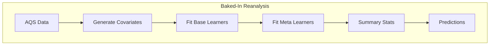
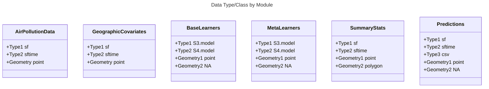

[](https://github.com/Spatiotemporal-Exposures-and-Toxicology/NRTAPmodel/actions/workflows/test-coverage.yaml)
[](https://codecov.io/gh/Spatiotemporal-Exposures-and-Toxicology/NRTAPmodel)
# Air Pollution Data for the Masses: An Open-Access, Tested, Updated PM<sub>2.5</sub> Hybrid Model 
 Group Project for the Spatiotemporal Exposures and Toxicology group with help from friends :smiley: :cowboy_hat_face:

## GitHub Push/Pull Workflow
1) Each collaborator has a local copy of the github repo - suggested location is ddn/gs1/username/home
2) Work locally
3) Push to remote
4) Kyle [or delegate] will pull to MAIN local copy on SET group ddn location

## Repo Rules 
1) To PUSH changes to the repo, the changes must be made to a non-MAIN branch
2) Then a PULL request must be made
3) Then it requires the REVIEW of 1 person (can be anyone)
4) Then the change from the branch is MERGED to the MAIN branch
   
## Overall Project Workflow


##  Unit and Integration Testing 

We will utilize various testing approaches to ensure functionality and quality of code

### Processes to test or check 
1) data type
2) data name
3) data size
4) relative paths
5) output of one module is the expectation of the input of the next module

### Test Drive Development
Starting from the end product, we work backwards while articulating the tests needed at each stage.

#### Final Product
File Type
1. NetCDF
2. Numeric, double precision
3. NA
4. Variable Names Exist
5. Naming Convention

Stats 
1. Non-negative variance ($\sigma^2$)
2. Mean is reasonable ($\mu$)
3. SI Units

Domain 
1. In the US (+ buffer)
2. In Time range (2018-2022)

Geographic 
1. Projections
2. Coordinate names (e.g. lat/lon)
3. Time in acceptable format 
#### Summary Statistics
File Type
1. NetCDF
2. csv
3. NA
4. Variable Names Exist
5. Naming Convention

Stats 
1. Non-negative variance ($\sigma^2$)
2. Mean is reasonable ($\mu$)
3. SI Units

Domain 
1. In the US (+ buffer)
2. In Time range (2018-2022)

Geographic 
1. Projections
2. Coordinate names (e.g. lat/lon)
3. Time in acceptable format
   
#### Meta Learners

#### Base Learners

#### Geographic Covariates

#### AQS Data
    

#### Each of the following are the classes of variables for the I/O that will need to be tested



### Frameworks for Testing of this project (with help from ChatGPT)

#### Test Driven Development (TDD)- Key Steps
1. **Write a Test**: Before you start writing any code, you write a test case for the functionality you want to implement. This test should fail initially because you haven't written the code to make it pass yet. The test defines the expected behavior of your code.

2. **Run the Test**: Run the test to ensure it fails. This step confirms that your test is correctly assessing the functionality you want to implement.

3. **Write the Minimum Code**: Write the minimum amount of code required to make the test pass. Don't worry about writing perfect or complete code at this stage; the goal is just to make the test pass.

4. **Run the Test Again**: After writing the code, run the test again. If it passes, it means your code now meets the specified requirements.

5. **Refactor (if necessary)**: If your code is working and the test passes, you can refactor your code to improve its quality, readability, or performance. The key here is that you should have test coverage to ensure you don't introduce new bugs while refactoring.

6. **Repeat**: Continue this cycle of writing a test, making it fail, writing the code to make it pass, and refactoring as needed. Each cycle should be very short and focused on a small piece of functionality.

7. **Complete the Feature**: Keep repeating the process until your code meets all the requirements for the feature you're working on.

TDD helps ensure that your code is reliable and that it remains functional as you make changes and updates. It also encourages a clear understanding of the requirements and promotes better code design.

**In addition to TDD, we will likely need to do ATDD:**

1. **Acceptance Test-Driven Development (ATDD)**: ATDD is a practice where tests are written to capture the acceptance criteria defined by stakeholders before development begins. These tests serve as a contract between developers and stakeholders, ensuring that the software meets the desired requirements.

2. **Continuous Integration (CI)**: While not a development methodology per se, CI is a practice where code changes are integrated into a shared repository multiple times a day. Automated tests are run with each integration to catch issues early. CI works well in conjunction with TDD.


```

## Base Learners 
Potential base learners we can use: 
1) PrestoGP (lasso + GP)
2) XGBOOST
3) RF
4) CNN
5) UMAP covariates
6) Encoder NN covariates

## Open Question
1) Publish Results to CRAN package


