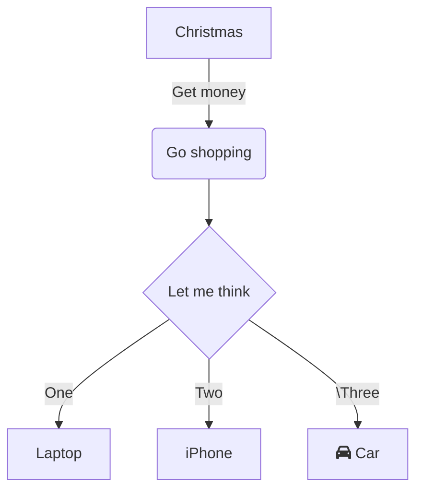

# NRT-AP-Model
**N**ear-**R**eal-**T**ime-**C**riteria-**A**ir-**P**ollutant-**M**odel work for {SET}




```geojson
{
  "type": "FeatureCollection",
  "features": [
    {
      "type": "Feature",
      "id": 1,
      "properties": {
        "ID": 0
      },
      "geometry": {
        "type": "Polygon",
        "coordinates": [
          [
              [-90,35],
              [-90,30],
              [-85,30],
              [-85,35],
              [-90,35]
          ]
        ]
      }
    }
  ]
}
```
