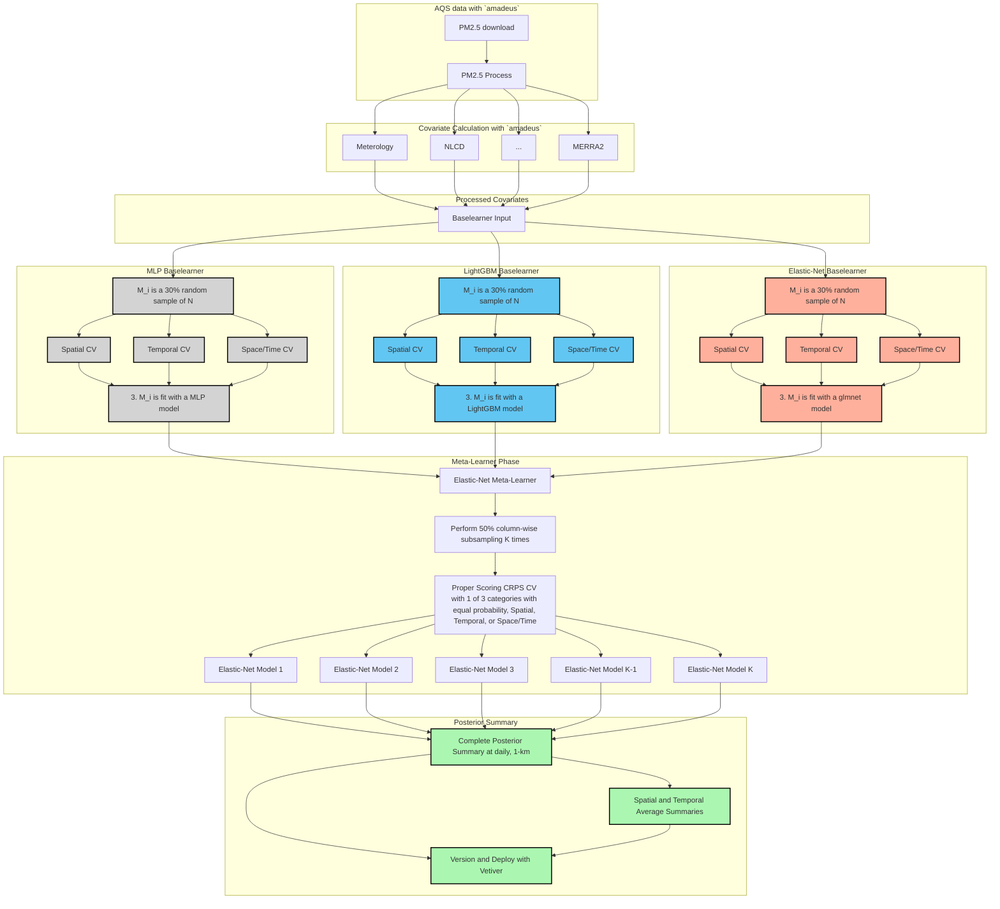
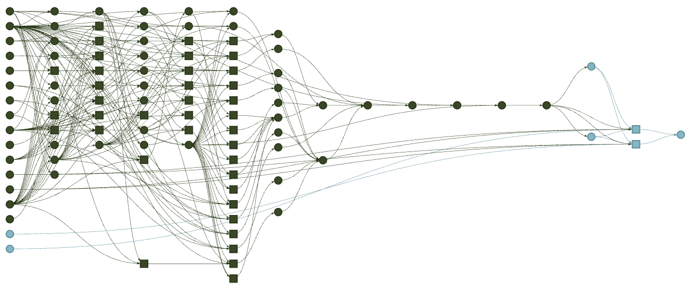

# Building an Extensible, rEproducible, Test-driven, Harmonized, Open-source, Versioned, ENsemble model for air quality <a href="https://niehs.github.io/beethoven"><a>

<p>
 
[](https://github.com/NIEHS/beethoven/actions/workflows/check-standard.yaml)
[](https://github.com/NIEHS/beethoven/actions/workflows/test-coverage.yaml)
[](https://github.com/NIEHS/beethoven/actions/workflows/lint.yaml)
[](https://lifecycle.r-lib.org/articles/stages.html#experimental)

Group Project for the Spatiotemporal Exposures and Toxicology group with help from friends :smiley: :cowboy_hat_face: :earth_americas: 

</p>

## Installation

```r
remotes::install_github("NIEHS/beethoven")
```

## Workflow

`beethoven` is a [targets](https://books.ropensci.org/targets/) reproducible analysis pipeline with the following workflow.



Version 0.4.4 of `beethoven` has stable `targets` for downloading data files, calculating features at AQS sites, and merging to a base learner-ready `data.table` (`dt_feat_calc_xyt`). Ongoing changes relate to calculating features for the prediction grid, computationally managing prediction grid, base learner hyperparameter tuning, and meta learner function development.

```r
targets::tar_visnetwork()
```


## Organization

Here, we describe the structure of the repository, important files, and the `targets` object naming conventions.

### Folder Structure

- `R/` is where the `beethoven` functions are stored. Only ".R" files should be in this folder (ie. `targets` helpers, post-processing, model fitting functions).
- `inst/` is a directory for arbitrary files outside of the main `R/` directory
     - `targets/` is a sub-directory within `inst/` which contains the pipeline files (ie. "targets_aqs.R"). These files declare the `targets::tar_target` objects which constitute the `beethoven` pipeline.
- `tests/` stores unit and integration tests (`testthat/`) and test data (`testdata/`) according to the [testthat](https://testthat.r-lib.org/) package's standard structure. for unit testing.
    - `testthat.R` is created and maintained by `testthat`, and is not to be edited manually.
- `container/` stores definition files and build scripts to build covariate- and model-specific Apptainer container images (`container_covariates.def` and `container_models.def`).
- `man/` contains function documentation files (".Rd") which are by the [roxygen2](https://roxygen2.r-lib.org/) package. These files are not to be edited manually.
- `vignettes/` contains ".Rmd" narrative text and code files. These are rendered by [pkgdown](https://pkgdown.r-lib.org/) into the [Articles](https://niehs.github.io/beethoven/articles/index.html) section of the `beethoven` webpage.
- `.github/workflows/` is a hidden directory which stores the GitHub CI/CD "yaml" files.
- `tools/` is dedicated to educational or demonstration material (e.g. Rshiny), but is not excluded from the package build.

### Important Files
- `_targets.R` configures `targets` settings, creates computational resource controllers, and structures the `beethoven` pipeline.
  - To run `beethoven`, users must review and update the following parameters for their user profile and computing system:
    - `controller_*` Ensure the local controllers do not request more CPUs than are available on your machine or high performance system.
    - `#SBATCH --partition` Utilization of NVIDIA GPUs (within `glue::glue` command)
    - `--bind /USER_PATH_TO_INPUT/input:/input` (within `glue::glue` command)
- `_targets.yaml` is created and updated by running `targets::tar_make` and is not to be edited manually.
- `run.sh` allocates computational resources with SLURM and submits the `beethoven` pipeline to run on high performance computing system.
  - To run `beethoven`, users must review and update the following parameters for their user profile and computing system:
    - `#SBATCH --mail-user`
    - `#SBATCH --partition`
    - `#SBATCH --mem`
    - `#SBATCH --cpus-per-task`
    - `--bind /USER_PATH_TO_INPUT/input:/input`
    - `--bind /USER_PATH_TO_SLURM/slurm:/USER_PATH_TO_SLURM/slurm`

### Running `beethoven` Pipeline

#### User settings
`beethoven` pipeline is configured for SLURM with defaults for NIEHS HPC settings. For adapting the settings to users' environment, consult with the documentation of your platform and edit the requested resources in `run.sh` (lines 3-11) and `_targets.R` (lines 41-45; individual `crew` and `crew.cluster` controller workers).

#### Critical `targets`
There are 5 "critical" `targets` that users may want to change to run `beethoven`.

  - `chr_daterange`
    - Controls all time-related targets for the entire pipeline. This is the only `target` that needs to be changed to update the pipeline with a new temopral range. Month and year specific arguments are derived from the time range defined by `chr_daterange`.
  - `chr_nasa_token`
    - Sets the file path to the user's NASA Earthdata account credentials. These credentials expire at ~90 day intervals and therefore must be updated regularly.
  - `chr_mod06_links`
    - The file path to the MOD06 links file. These links must be manually downloaded per the `amadeus::download_modis` function. The links are then stored in a CSV file that is read by the function. The new file with links must be updated to match the new date range.
  - `chr_input_dir`
    - The file path to the input directory. This target controls where the raw data files are downloaded to and imported from. This file path must be mounted to the container at run time in the `run.sh` script.
  - `num_dates_split`
    - Controls the size of temporal splits. Splitting the temporal range into smaller chunks allows for parallel processing across multiple workers. It also allows for dispatching new dynamic branches when the temporal range is updated.

#### `Apptainer`
Current implementation of `beethoven` utilizes `Apptainer` images to run the pipeline with consistent package versions and custom installations. Users must build these images before runnning beethoven.

```sh
cd container/ # must be working in the `container/` directory
sh build_container_covariates.sh # build "covariates" stage image
sh build_container_models.sh # build "models" image
mv *sif ../ # move images to `beethoven/` root directory
```

> [!NOTE]
> `.sif` files are omitted from GitHub due to size (>5 Gb each)

#### Run
After switching back to the project root directory, users can run the pipeline with the `run.sh` shell script. The following lines of `run.sh` must be updated with user-specific settings before running the pipeline

```sh
#SBATCH --mail-user=[USER_EMAIL]      # email address for job notifications
#SBATCH --partition=[PARTITION_NAME]  # HPC partition to run on
#SBATCH --mem=[###G]                  # Total memory for the job
#SBATCH --cpus-per-task=[###]         # Total CPUs for the job
...
  --bind [USER_INPUT_DIRECTORY]/input:/input \
...
  --bind [USER_SYSTEM_PATH/munge]:/run/munge \
  --bind [USER_SYSTEM_PATH/slurm]:[USER_SYSTEM_PATH/slurm] \
```

Once configured, the pipeline can be run with a `SLRUM` batch job.

```sh
cd ../ # assuming still in the `container/` directory
sbatch run.sh
```

The SLURM batch job can also be submitted `R` session with the `batch` helper function.

```r
source("R/helpers.R")
batch()
```

# Contribution
The [Developer's Guide](https://github.com/NIEHS/beethoven/tree/main/inst/targets#developers-guide) provides detailed instructions for how to develop or update `beethoven` settings or individual `targets` objecdts

To contribute developments or modifications, open a [Pull request](https://github.com/NIEHS/beethoven/pulls) into the `dev` branch with a detailed description of the proposed changes. Pull requests must pass all status checks, and then will be approved or rejected by `beethoven`'s authors.

Utilize [Issues](https://github.com/NIEHS/beethoven/issues) to notify the authors of bugs, questions, or recommendations. Identify each issue with the appropriate label to help ensure a timely response.
