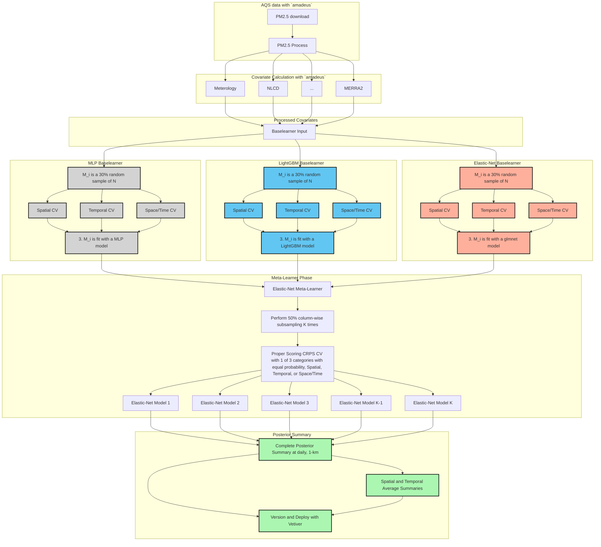

# Building an Extensible, rEproducible, Test-driven, Harmonized, Open-source, Versioned, ENsemble model for air quality <a href="https://niehs.github.io/beethoven"><a>


<p>
 
[](https://github.com/NIEHS/beethoven/actions/workflows/check-standard.yaml)
[](https://github.com/NIEHS/beethoven/actions)
[](https://github.com/NIEHS/beethoven/actions/workflows/lint.yaml)
[](https://lifecycle.r-lib.org/articles/stages.html#experimental)


Group Project for the Spatiotemporal Exposures and Toxicology group with help from friends :smiley: :cowboy_hat_face: :earth_americas: 


</p>
    
    
## Installation

```r
remotes::install_github("NIEHS/beethoven")
```

## Overall Project Workflow

Targets: Make-like Reproducible Analysis Pipeline
 1) AQS Data
 2) Generate Covariates
 3) Fit Base Learners
 4) Fit Meta Learners
 5) Predictions
 6) Summary Stats


 
**Placeholder for up-to-date rendering of targets**

```r
tar_visnetwork(targets)
```
    

## Project Organization

Here, we describe the structure of the project and the naming conventions used. The most up to date file paths and names are recorded here for reference.

### File Structure

#### Folder Structure

- `R/` This is where the main R code (e.g. .R files) lives. Nothing else but .R files should be in here. i.e. Target helper functions, model fitting and post-processing, plotting and summary functions. 
- `tests/` This is where the unit and integration tests reside. The structure is based off the standard practices of the [testthat](https://testthat.r-lib.org/) R package for unit testing.
    - `testthat` Unit and integration tests for CI/CD reside here
    - `testdata` Small test datasets including our small (in size) complete pipeline testing. 
    - `testthat.R` Special script created and maintained by testthat
- `man/` This sub-directory contains .Rd and othe files created by the [roxygen2](https://roxygen2.r-lib.org/) package for assisted documentation of R packages
- `vignettes/` Rmd (and potentially Qmd) narrative text and code files. These are rendered into the **Articles** for the package website created by [pkgdown](https://pkgdown.r-lib.org/) 
- `inst/` Is a sub-directory for arbitrary files outside of the main `R/` directory
     - `targets` which include the important pipeline file `_targets.R`
- `.github/workflows/` This hidden directory is where the GitHub CI/CD yaml files reside

##### The following sub-directories are not including the package build and included only in the source code here
- `tools/` This sub-directory is dedicated to educational or demonstration material (e.g. Rshiny).
  
#### Relevant files 

- LICENSE
- DESCRIPTION
- NAMESPACE 
- README.md

### Naming Conventions

Naming things is hard and somewhat subjective. Nonetheless, consistent naming conventions make for better reproducibility, interpretability, and future extensibility. 
Here, we provide the `beethoven` naming conventions for objects as used in `targets` and for naming functions within the package (i.e. **R/**). 
For `tar_target` functions, we use the following naming conventions:


Naming conventions for `targets` objects. We are motivated by the [Compositional Forecast](https://cfconventions.org/Data/cf-standard-names/docs/guidelines.html) (CF) model naming conventions:

e.g. [surface] [component] standard_name [at surface] [in medium] [due to process] [assuming condition]
In CF, the entire process can be known from the required and optional naming pieces. 

Here, we use the following naming convention:

**[R object type]\_[role-suffix]\_[stage]\_[source]\_[spacetime]**

 Each section is in the brackets [] and appears in this order. For some objects, not all naming sections are required. If two keywords in a section apply, then they are appended with a `-`

Examples: 1) `sf_PM25_log10-fit_AQS_siteid` is an `sf` object for `PM25` data that is log-transformed and ready for base-learner fitting, derived from AQS data and located at the siteid locations. 
2) `SpatRast_process_MODIS` is a terra `SpatRast` object that has been processed from MODIS.


#### Naming section definitions:

- **R object type**: chr (character), list, sf, dt (datatable), tibble, SpatRaster, SpatVector

- **role:** Detailed description of the role of the object in the pipeline. Allowable keywords:

  - PM25
  - feat (feature) (i.e. geographic covariate) 
  - base_model
    - base_model suffix types: linear, random_forest, lgb (lightGBM), xgb (xgboost), mlp (neural network, multilayer perceptron) etc.
  - meta_model 
  - prediction
  - plot
    -plot suffix types: scatter, map, time_series, histogram, density etc. 
  
- **stage**: the stage of the pipeline the object is used in. Object transformations
are also articulated here. Allowable keywords: 

  - raw
  - calc: results from processing-calculation chains
  - fit: Ready for base/meta learner fitting
  - result: Final result
  - log
  - log10 

- **source:** the original data source

  - AQS
  - MODIS
  - GMTED 
  - NLCD
  - NARR
  - GEOSCF
  - TRI
  - NEI
  - KOPPENGEIGER
  - HMS
  - gROADS
  - POPULATION
  - [Note, we can add and/or update these sources as needed] 

- **spacetime:** relevant spatial or temporal information 

  - spatial: 
    - siteid
    - censustract
    - grid
  - time: 
    - daily  [optional YYYYMMDD]
    - annual  [optional YYYY]


### Function Naming Convenctions 

We have adopted naming conventions in functions in this package as well as `amadeus` which is a key input package. 

**[High-Level-Process]\_[Source]\_[Object]**

- **High-Level-Process**
     - download
     - process
     - calc

- **source:** the original data source. Same as source section for tar objects

- **Object** An object that the function may be acting on
     - base_model (base)
     - meta_model (meta)
     - feature (feat) 


 
### To run the pipeline
#### Post-checkout hook setting
As safeguard measures, we limit the write permission of `_targets.R` to authorized users. To activate post-checkout hook, run `setup_hook.sh` at the project root.

```shell
. setup_hook.sh
```

The write privilege lock is applied immediately. Users will be able to run the pipeline with the static `_targets.R` file to (re-)generate outputs from the pipeline.

#### User settings
`beethoven` pipeline is configured for SLURM with defaults for NIEHS HPC settings. For adapting the settings to users' environment, consult with the documentation of your platform and edit the `_targets.R` and `inst/targets/targets_calculate.R` (i.e., resource management) accordingly.

#### Setting `_targets.R`
For general users, all `targets` objects and `meta` information can be saved in a directory other than the pipeline default by changing `store` value in `tar_config_set()` at `_targets.R` in project root.

```r
# replacing yaml file.
tar_config_set(
  store = "__your_directory__"
)
```

Users could comment out the three lines to keep targets in `_targets` directory under the project root. Common arguments are generated in the earlier lines in `_targets.R` file. Details of the function generating the arguments, `set_args_calc`, are described in the following.


#### Using `set_args_calc`
`set_args_calc` function exports or returns common parameters that are used repeatedly throughout the calculation process. The default commands are as below:

```r
set_args_calc(
  char_siteid = "site_id",
  char_timeid = "time",
  char_period = c("2018-01-01", "2022-12-31"),
  num_extent = c(-126, -62, 22, 52),
  char_user_email = paste0(Sys.getenv("USER"), "@nih.gov"),
  export = FALSE,
  path_export = "inst/targets/calc_spec.qs",
  path_input = "input",
  nthreads_nasa = 14L,
  nthreads_tri = 5L,
  nthreads_geoscf = 10L,
  nthreads_gmted = 4L,
  nthreads_narr = 24L,
  nthreads_groads = 3L,
  nthreads_population = 3L
)
```

All arguments except for `char_siteid` and `char_timeid` should be carefully set to match users' environment. `export = TRUE` is recommended if there is no pre-generated qs file for calculation parameters. For more details, consult `?set_args_calc` after loading `beethoven` in your R interactive session.

#### Running the pipeline
After switching to the project root directory (in terminal, `cd [project_root]`, replace `[project_root]` with the proper path), users can run the pipeline.

> [!NOTE]
> With `export = TRUE`, it will take some time to proceed to the next because it will recursively search hdf file paths. The time is affected by the number of files to search or the length of the period (`char_period`).

> [!WARNING]
> Please make sure that you are at the project root before proceeding to the following. The HPC example requires additional edits related to SBATCH directives and project root directory.

```shell
Rscript inst/targets/targets_start.R &
```

Or in NIEHS HPC, modify several lines to match your user environment:

```shell
# ...
#SBATCH --output=YOUR_PATH/pipeline_out.out
#SBATCH --error=YOUR_PATH/pipeline_err.err
# ...
# The --mail-user flag is optional
#SBATCH --mail-user=MYACCOUNT@nih.gov
# ...
USER_PROJDIR=/YOUR/PROJECT/ROOT
nohup nice -4 Rscript $USER_PROJDIR/inst/targets/targets_start.R
```

`YOUR_PATH`, `MYACCOUNT` and `/YOUR_PROJECT_ROOT` should be changed. In the end, you can run the following command:

```shell
sbatch inst/targets/run.sh
```

The script will submit a job with effective commands with SLURM level directives defined by lines starting `#SBATCH`, which allocate CPU threads and memory from the specified partition.

`inst/targets/run.sh` includes several lines exporting environment variables to bind GDAL/GEOS/PROJ versions newer than system default, geospatial packages built upon these libraries, and the user library location where required packages are installed. The environment variables need to be changed following NIEHS HPC system changes in the future.

> [!WARNING]
> `set_args_*` family for downloading and summarizing prediction outcomes will be added in the future version.

