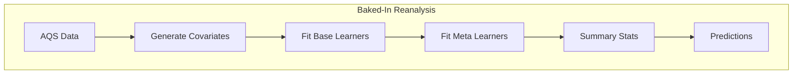

# Near Real Time Air Pollution Model 
## Group Project for the Spatiotemporal Exposures and Toxicology group with help from friends :smiley:

## GitHub Push/Pull Workflow
1) Each collaborator has a local copy of the github repo - suggested location is ddn/gs1/username/home
2) Work locally
3) Push to remote
4) Kyle [or delegate] will pull to MAIN local copy on SET group ddn location

## Repo Rules 
1) To PUSH changes to the repo, the changes must be made to a non-MAIN branch
2) Then a PULL request must be made
3) Then it requires the REVIEW of 1 person (can be anyone)
4) Then the change from the branch is MERGED to the MAIN branch
   
## Overall Project Workflow

##  Unit and Integration Testing 

We will utilize various testing approaches to ensure functionality and quality of code

### Processes to test or check 
1) relative paths
2) variable names
3) variable types
4) variable sizes
5) Output of one module is the expectation of the input of the next module
   
