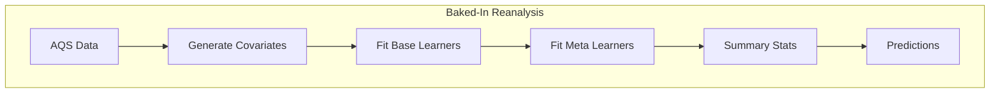

# Near Real Time Air Pollution Model 
## Group Project for the Spatiotemporal Exposures and Toxicology group with help from friends :smiley:

## GitHub Push/Pull Workflow
1) Each collaborator has a local copy of the github repo - suggested location is ddn/gs1/username/home
2) Work locally
3) Push to remote
4) Kyle [or delegate] will pull to MAIN local copy on SET group ddn location

## Overall Project Workflow

##  Unit and Integration Testing 

We will utilize various testing approaches to ensure functionality and quality of code

