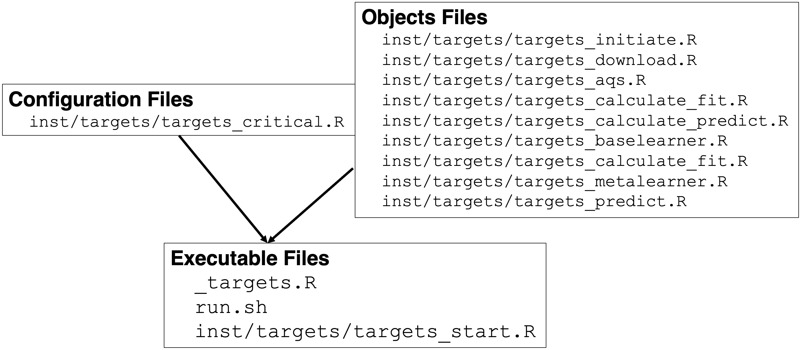

# Building an Extensible, rEproducible, Test-driven, Harmonized, Open-source, Versioned, ENsemble model for air quality <a href="https://niehs.github.io/beethoven"><a>

<p>
 
[](https://github.com/NIEHS/beethoven/actions/workflows/check-standard.yaml)
[](https://github.com/NIEHS/beethoven/actions/workflows/test-coverage.yaml)
[](https://github.com/NIEHS/beethoven/actions/workflows/lint.yaml)
[](https://lifecycle.r-lib.org/articles/stages.html#experimental)

Group Project for the Spatiotemporal Exposures and Toxicology group with help from friends :smiley: :cowboy_hat_face: :earth_americas: 

</p>

## Installation

```r
remotes::install_github("NIEHS/beethoven")
```

## Workflow

`beethoven` is a [targets](https://books.ropensci.org/targets/) reproducible analysis pipeline with the following workflow.


Version 0.4.4 of `beethoven` has stable `targets` for downloading data files, calculating features at AQS sites, and merging to a base learner-ready `data.table` (`dt_feat_calc_xyt`). Ongoing changes relate to calculating features for the prediction grid, computationally managing prediction grid, base learner hyperparameter tuning, and meta learner function development.

```r
targets::tar_visnetwork()
```


## Organization

Here, we describe the structure of the repository, important files, and the `targets` object naming conventions.

### Folder Structure

- `R/` is where the `beethoven` functions are stored. Only ".R" files should be in this folder (ie. `targets` helpers, post-processing, model fitting functions).
- `inst/` is a directory for arbitrary files outside of the main `R/` directory
     - `targets/` is a sub-directory within `inst/` which contains the pipeline files (ie. "targets_aqs.R"). These files declare the `targets::tar_target` objects which constitute the `beethoven` pipeline.
- `tests/` stores unit and integration tests (`testthat/`) and test data (`testdata/`) according to the [testthat](https://testthat.r-lib.org/) package's standard structure. for unit testing.
    - `testthat.R` is created and maintained by `testthat`, and is not to be edited manually.
- `man/` contains function documentation files (".Rd") which are by the [roxygen2](https://roxygen2.r-lib.org/) package. These files are not to be edited manually.
- `vignettes/` contains ".Rmd" narrative text and code files. These are rendered by [pkgdown](https://pkgdown.r-lib.org/) into the [Articles](https://niehs.github.io/beethoven/articles/index.html) section of the `beethoven` webpage.
- `.github/workflows/` is a hidden directory which stores the GitHub CI/CD "yaml" files.
- `tools/` is dedicated to educational or demonstration material (e.g. Rshiny), but is not excluded from the package build.

### Important Files
- `_targets.R` configures `targets` settings, creates computational resource controllers, and structures the `beethoven` pipeline.
  - To run `beethoven`, users must review and update the following parameters for their user profile and computing system:
    - `controller_*` Ensure the local controllers do not request more CPUs than are available on your machine or high performance system.
    - `#SBATCH --partition` Utilization of NVIDIA GPUs (within `glue::glue` command)
    - `--bind /USER_PATH_TO_INPUT/input:/input` (within `glue::glue` command)
- `_targets.yaml` is created and updated by running `targets::tar_make` and is not to be edited manually.
- `run.sh` allocates computational resources with SLURM and submits the `beethoven` pipeline to run on high performance computing system.
  - To run `beethoven`, users must review and update the following parameters for their user profile and computing system:
    - `#SBATCH --mail-user`
    - `#SBATCH --partition`
    - `#SBATCH --mem`
    - `#SBATCH --cpus-per-task`
    - `--bind /USER_PATH_TO_INPUT/input:/input`
    - `--bind /USER_PATH_TO_SLURM/slurm:/USER_PATH_TO_SLURM/slurm`

### Naming Conventions

Naming conventions for `targets` objects are motivated by the [Compositional Forecast](https://cfconventions.org/Data/cf-standard-names/docs/guidelines.html) (CF) model naming conventions. By adopting the this convention, the name of each `targets` object communicates important information about its class, role, stage, and source.

Here, we use the following naming convention:

**[class]\_[role-suffix]\_[stage]\_[source/description]\_[spacetime]**

Each section is in the brackets [] and appears in this order. For some objects, not all naming sections are required. If two keywords in a section apply, then they are appended with a `-`

Examples:

`dt_feat_calc_geos`
  - class: `dt` <- `data.table`
  - role: `feat` <- features
  - stage: `calc` <- calculated
  - source: `geos` <- [NASA GEOS Composition Forecasting (GEOS-CF)](https://gmao.gsfc.nasa.gov/weather_prediction/GEOS-CF/)

`list_base_params_candidates`
  - class: `list`
  - role: `base` <- base learners
  - description: `params` <- hyperparameters
  - description: `candidates` <- `tune`-able parameters

`list_base_fit_gpu`
  - class: `list`
  - role: `base` <- base learners
  - stage: `fit`
  - description: `gpu`

#### Naming section definitions:

- **R object type**:
  - `chr` (character)
  - `list`
  - `sf`
  - `dt` <- `data.table`
  - `tbl` <- `tibble`
  - `rast` <- `SpatRaster`
  - `vect` <- `SpatVector`

- **role:** Detailed description of the role of the object in the pipeline. Allowable keywords:
  - PM25
  - feat (feature) (i.e. geographic covariate) 
  - base_model
    - base_model suffix types: linear, random_forest, lgb (lightGBM), xgb (xgboost), mlp (neural network, multilayer perceptron) etc.
  - meta_model 
  - prediction
  - plot
    -plot suffix types: scatter, map, time_series, histogram, density etc. 
  
- **stage**: the stage of the pipeline the object is used in. Object transformations
are also articulated here. Allowable keywords: 
  - download: raw downloaded data
  - proc: processed data
  - calc: results from processing-calculation chains
  - fit: fit models
  - result: Final result
  - log
  - log10 

- **source:** the original data source
  - AQS
  - MODIS
  - GMTED 
  - NLCD
  - NARR
  - GEOSCF
  - TRI
  - NEI
  - KOPPENGEIGER
  - HMS
  - gROADS
  - POPULATION
  - [Note, we can add and/or update these sources as needed] 

- **description:** additional descriptors
  - params: hyperparameters
  - args: arguments
  - cpu: CPU-enabled base/meta learner
  - gpu: GPU-enabled base/meta learner

- **spacetime:** relevant spatial or temporal information 
  - spatial: 
    - siteid
    - censustract
    - grid
  - time: 
    - daily  [optional YYYYMMDD]
    - annual  [optional YYYY]

### Running `beethoven` Pipeline
#### Post-checkout hook setting
As safeguard measures, we limit the write permission of `_targets.R` to authorized users. To activate post-checkout hook, run `setup_hook.sh` at the project root.

```shell
. setup_hook.sh
```

The write privilege lock is applied immediately. Users will be able to run the pipeline with the static `_targets.R` file to (re-)generate outputs from the pipeline.

#### User settings
`beethoven` pipeline is configured for SLURM with defaults for NIEHS HPC settings. For adapting the settings to users' environment, consult with the documentation of your platform and edit the requested resources in `run.sh` (lines 3-11) and `_targets.R` (lines 41-45; individual `crew` and `crew.cluster` controller workers).

#### Setting `_targets.R`
For general users, all `targets` objects and `meta` information can be saved in a directory other than the pipeline default by changing `store` value in `tar_config_set()` at `_targets.R` in project root.

```r
# replacing yaml file.
tar_config_set(
  store = "__your_directory__"
)
```

Users could comment out the three lines to keep targets in `_targets` directory under the project root. Common arguments are generated in the earlier lines in `_targets.R` file.

#### Critical `targets`
There are 5 "critical" `targets` that users may want to change to run `beethoven`.

  - `chr_daterange`
    - Controls all time-related targets for the entire pipeline. This is the only `target` that needs to be changed to update the pipeline with a new temopral range. Month and year specific arguments are derived from the time range defined by `chr_daterange`.
  - `chr_nasa_token`
    - Sets the file path to the user's NASA Earthdata account credentials. These credentials expire at ~90 day intervals and therefore must be updated regularly.
  - `chr_mod06_links`
    - The file path to the MOD06 links file. These links must be manually downloaded per the `amadeus::download_modis` function. The links are then stored in a CSV file that is read by the function. The new file with links must be updated to match the new date range.
  - `chr_input_dir`
    - The file path to the input directory. This target controls where the raw data files are downloaded to and imported from. This file path must be mounted to the container at run time in the `run.sh` script.
  - `num_dates_split`
    - Controls the size of temporal splits. Splitting the temporal range into smaller chunks allows for parallel processing across multiple workers. It also allows for dispatching new dynamic branches when the temporal range is updated.

#### `Apptainer`
Current implementation of `beethoven` utilizes `Apptainer` images to run the pipeline with consistent package versions and custom installations. Users must build these images before runnning beethoven.

```sh
cd container/ # must be working in the `container/` directory
sh build_container_covariates.sh # build "covariates" stage image
sh build_container_models.sh # build "models" image
mv *sif ../ # move images to `beethoven/` root directory
```

> [!NOTE]
> `.sif` files are omitted from GitHub due to size (>5 Gb each)

#### Run
After switching back to the project root directory, users can run the pipeline with the `run.sh` shell script. The following lines of `run.sh` must be updated with user-specific settings before running the pipeline

```sh
#SBATCH --mail-user=[USER_EMAIL]      # email address for job notifications
#SBATCH --partition=[PARTITION_NAME]  # HPC partition to run on
#SBATCH --mem=[###G]                  # Total memory for the job
#SBATCH --cpus-per-task=[###]         # Total CPUs for the job
...
  --bind [USER_INPUT_DIRECTORY]/input:/input \
...
  --bind [USER_SYSTEM_PATH/munge]:/run/munge \
  --bind [USER_SYSTEM_PATH/slurm]:[USER_SYSTEM_PATH/slurm] \
```

Once configured, the pipeline can be run with a `SLRUM` batch job.

```sh
cd ../ # assuming still in the `container/` directory
sbatch run.sh
```

The SLURM batch job can also be submitted `R` session with the `batch` helper function.

```r
source("R/helpers.R")
batch()
```

# Developer's guide

## Preamble
The objective of this document is to provide developers with the current implementation of `beethoven` pipeline for version 0.4.4.

We assume the potential users have basic knowledge of `targets` and `tarchetypes` packages as well as functional and meta-programming. It is recommended to read Advanced R (by Hadley Wickham)'s chapters for these topics.

## Pipeline component and basic implementation
The pipeline is based on `targets` package. All targets are **stored** in a designated storage, which can be either a directory path or a URL when one uses cloud storage or web servers. Here we classify the components into three groups:

1. Execution: high level script to run the pipeline.
2. Critical: common/critical arguments that are injected into functions.
3. Objects: definitions of each `target` object.

Let's take a moment to be a user. You should consult specific file when:
- You need to modify library dependencies, `target` storage location, or controller settings: `_targets.R`.
- You get an error `File or directory not found`: `run.sh` (Lines 32 and 49), `_targets.R` (Line 41), `inst/targets/targets_critical.R` (Line 47)
- You do not get SLURM job notifications via email: `run.sh`(Line 4)
- Failed dispatched `target` objects: `inst/targets/targets_*.R` (error will report failed `target`)

> [!NOTE]
> Please expand the toggle below to display function trees for `inst/targets/targets_*.R` files. Only functions that are directly called in each file are displayed due to screen real estate and readability concerns.

<details>
<summary>`targets_*.R` file function tree</summary>


</details>



The details of argument injection is illustrated below. The specific arguments to inject are loaded from QS files that are required to be saved in `inst/targets` directory. Each QS file contains a nested list object where function arguments for downloading raw data and calculating features are defined and store.


As a compromise between the layouts for standard R packages and `targets` pipelines, we mainly keep `tar_target()` definitions in `inst/targets/`, whereas the `targets` required components are stored in the project root. All targets are recorded in `_targets/` directory by default, and it can be changed to somewhere else by defining an external directory at `store` argument in `tar_config_set()` in `_targets.R`.

## Before running the pipeline
- Container
  - The container images, `container_covariates.sif` and `container_models.sif`, are not hosted on GitHub due to the large file size. The images must be built by each user before running the pipeline. Definition files for each images can be found at `container/container_covariates.def` and `container/container_models.def`, respectively. The images can be build by running `sh build_container_[covariates/models].sh` **from within the `container/` folder**, or running `sbatch build_container_[covariates/models].sh`.

- Shell
  - The `run.sh` file controls SLURM submission details (ie, `--mem`, `--cpus-per-task`) and container settings (ie. `container_[covariates/models].sif`, mounted directories). Local directories which must be explicitly mounted to the container for covariate and model runs are 1. the group data store (`--bind /ddn/gs1/group/set/Projects/NRT-AP-Model/input:/input`), 2. local targets store (`--bind $PWD/_targets:/opt/_targets`), and 3. the `inst/` folder which has the targets (`--bind $PWD/_targets:/opt/_targets`). The model fitting stage uses the `crew.cluster::crew_controller_slurm` controller, and therefore requires **local installation and settings of** `munge` (`--bind /run/munge:/run/munge`) and `slurm` (`--bind /ddn/gs1/tools/slurm/etc/slurm:/ddn/gs1/tools/slurm/etc/slurm`).

- R
  - `_targets.R`: Ensure each `crew::crew_controller_local` does not specify more workers than the total number workers requested in `run.R` (line 9).
  - `_targets.R`: Ensure `targets` store (line 63) matches the mount location in `run.sh` (lines 33 and 47 **after the semicolon**).
  - `inst/targets/targets_critical.R`: Critical targets are those which will require changes between users (`chr_nasa_token`), for development (`num_dates_split`), manual updates (`/inst/extdata/mod06_links_2018_2022.csv` called via `chr_mod06_links`), and mounted data path (`chr_input_dir`). **Most importantly**, critical target `chr_daterange` controls the entire temporal range of the downstream pipeline. Time-related specifications (dates, months, years, julian dates, etc) are defined relative to `chr_daterange`.

## Dynamic branching with `targets`

`beethoven` implements [`targets` dynamic branching](https://books.ropensci.org/targets/dynamic.html) to iterate function calls over a series of parameter inputs. When dynamic branching is used, the "grand target" is the `tar_target`, and should be a list, either being a nested or a plain list, depending on the context or the command run inside each branch.

The following example shows `download_geos`, a dynamically branched target. `download_geos` is the "grand target", and is a `list` consisting of 30 hash values returned from `download_geos` function call. The 30 values stem from 2 GEOS-CF collections (`c("aqc_tavg_1hr_g1440x721_v1", "chm_tavg_1hr_g1440x721_v1")`) and 15 temporal breaks (365 days * 5 years / 122 days).

```r
...
    targets::tar_target(
      download_geos,
      command = amadeus::download_geos(
        collection = chr_iter_calc_geos,
        directory_to_save = file.path(chr_input_dir, "geos"),
        date = beethoven::fl_dates(unlist(list_dates)),
        remove_command = list_download_args$remove_command,
        acknowledgement = list_download_args$acknowledgement,
        download = list_download_args$download,
        hash = list_download_args$hash
      ),
      pattern = cross(chr_iter_calc_geos, list_dates),
      description = "Download GEOS-CF data | download"
    )
...
```

## `Sys.getenv("BEETHOVEN")`
As previously mentioned, the `beethoven` pipeline is run through `Apptainer` image. More specifically, it has two stages, "covariates" and "models", which are run through separate container images, `container_covariates.sif` and `container_models.sif`, respectively. These two separate images are used to avoid discrepancies between spatial- and machine learning-oriented R packages, which may utilize different versions of the same underlying dependencies.

The "covariates" stage of the pipeline downloads raw data files to the `input/` directory, calculates features from these data at AQS sites and prediction point locations (in development), and combines and imputes the data. Relevant `targets` files (from the `inst/targets/` directory) include `targets_initiate.R`, `targets_download.R`, `targets_aqs.R`, `targets_calculate_fit.R`, and `targets_calculate_predict.R`. The `container_covariates.sif` image is built from the `rocker/geospatial:latest` base [image](https://github.com/rocker-org/rocker-versioned2/blob/master/dockerfiles/geospatial_4.4.2.Dockerfile).

The "models" stage of the pipline fits the base and meta learner models, predicts values at prediction point locations, and computes summary statistics (all in development). Relevant `targets` files include `targets_initiate.R`, `targets_baselearner.R`, `targets_metalearner.R`, `targets_predict.R`. The `container_models.sif` image is built from `nvidia/cuda:11.8.0-devel-ubuntu22.04` with GPU-enabled versions of `torch`, `brulee`, `xgboost`, and `lightGBM` installed from GitHub or built from source. The R packages included in the `container_models.def` file are derived from those included in `rocker/ml-verse:lastest` base [image](https://github.com/rocker-org/rocker-versioned2/blob/master/dockerfiles/ml-verse_4.4.2.Dockerfile). `container_models.def` installs development version of CUDA 11.8 to include toolkit (`nvcc`).

The `run.sh` and `_targets.R` files manage the pipeline stages. In the `run.sh` script, the environmental variable `BEETHOVEN` is set before the container run to identify the stage. This environmental variable is then read in the `_targets.R` file. If the `_targets.R` file identifes the "covariates" stage, the base and meta learner and prediction `targets` are set to `NULL` to skip. If "models" stage, these `targets` are dispatched.

`run.sh` (Lines 24-26)
```sh
# Set environmental variable to indicate download and covariate
# calculation targets.
export BEETHOVEN=covariates
```

`_targets.R` (Lines 111-113)
```r
if (Sys.getenv("BEETHOVEN") == "covariates") {
  target_baselearner <- target_metalearner <- target_predict <- NULL
}
```

## `beethoven` objects

### `list_feat_calc_nlcd`
From version 0.3.10, NLCD target is separated from `list_feat_calc_base` from runtime concerns. Here we take nested parallelization strategy, where each `amadeus::calc_nlcd()` run with different year and buffer size is parallelized where each will use 10 threads. In the initial study period, we have six combinations (two NLCD years in 2019 and 2021, and three radii of 1, 10, and 50 kilometers). Thus, the NLCD target will use 60 threads, but not necessarily concurrently. Each combination will get its slot in the resulting list target, therefore the following `dt_feat_calc_nlcd` is created by `data.frame` pivotting.

### `list_feat_calc_nasa`
MODIS-VIIRS product processing is a bit more complex than others since many preprocessing steps are involved in this raw data. Please note that `chr_iter_calc_nasa` divides MOD19A2 product by spatial resolution since difference in spatial resolution of raster layers makes it difficult to stack layers that can be advantageous to improve processing speed. The branching itself is simple to use a character vector of length 7 to iterate the process, but there is a different avenue that might introduce complexity in terms of computational infrastructure and implementation of parallel processing.

We introduced nested parallelization to expedite the MODIS/VIIRS processing, where `tar_make_future` will submit jobs per MODIS/VIIRS product code via SLURM batchtools and multiple threads are used in each job. If one wants to make a transition to `crew` based pipeline operation in the future, this part indeed requires a tremendous amount of refactoring not only in beethoven functions but also amadeus functions considering features of `crew`/`mirai` workers which are different from `future`.

### `list_feat_calc_geoscf`
We use a character vector of length 2 to distinguish chm from aqc products. A modified version of `amadeus::calc_geos`, `calc_geos_strict` is employed to calculate features. The key modification is to fix the radius argument as zero then to remove the top-level argument radius from the function.

### `list_feat_calc_gmted`
Here we use custom function `calc_gmted_direct`, which has different logic from what was used in `amadeus::calc_gmted`. `inject_gmted` uses that function to parallelize the calculation by radius length.

### `list_feat_calc_narr`
Again, modified functions `process_narr2` and `calc_narr2` are applied and the parallelization for NARR data is done by `par_narr`. Here we did not branch out by NARR variable names since they are a bit long (length of 46) such that each dispatched branch will add up overhead to submit SLURM job for each variable.

## Merge branches

Functions with prefix `post_calc_` merge branches, which contain various internal structures. Most of the branches are list of depth 1, which means `data.frame` or `data.table` objects are in each list element. Others are list of depth 2. 

### Tackling space-time discrepancy

Each source data have different temporal resolution and update frequency. This leads to the different dimensions across targets due to the measures to save time for computation. For example, NLCD targets will get N (number of sites) times 2 (2019 and 2021 per initial study period as of August 2024), whereas NARR targets will get N times $|D|$ (where $D$ is the set of dates), which equals to the full site-date combinations during the study period. To tackle the discrepancy across calculated targets, automatic expansion strategy is implemented by inferring temporal resolution from targets. Automatic expansion starts from resolving native temporal resolution from each target then proceeds to adding a provisional field year from date, which is removed after all required join operations will be completed. Most of the time, date-to-year conversion is performed internally in `expand` functions in `beethoven` and full space-time `data.frame` is prioritized to left join the multiple targets.

### Value filling strategies

Temporal resolution discrepancy makes `NA` values in joined `data.frame`s. In MODIS/VIIRS targets, NDVI (a subdataset of MOD13A1 product) is based on a 16-day cycle, differing from other products on a daily cycle. We consider the reported date of "16-day cycle" as the **last day** of the cycle. 

* **MODIS/VIIRS**: Therefore, the `NA` values introduced by joining `data.frame`s by date field are filled in `impute_all` using `data.table::setnafill` with next observation carried forward (`type = "nocb"`) option.
* MODIS/VIIRS targets may have `NaN` values where nonexisting values are assigned as replacements. These values are replaced with `NA` at first, then with zeros.
* Other nonignorable `NA`s in the joined target will be imputed by missForest (name of the original method used; actually using `missRanger` package for efficiency).

### Autojoin functions

Automatic join function `post_calc_autojoin` is one of the most complex function in `beethoven` codebase, which encapsulates the efforts to resolve all sorts of space-time discrepancies across targets. Full and coarse site-date combinations and full and coarse site-year combinations are automatically resolved in the function. The coarse site-year combination is a challenge since some years are out of the study period and such *anchor* years should be repeated to fill in for no gaps in the joined data. Another `post_calc_df_year_expand` and its upstream `post_calc_year_expand` function repeat coarse site-year `data.frame`s properly to ensure that there will be no years with missing values.

```r
post_calc_autojoin <-
  function(
    df_fine,
    df_coarse,
    field_sp = "site_id",
    field_t = "time",
    year_start = 2018L,
    year_end = 2022L
  ) {
    # Dataset specific preprocessing
    if (any(grepl("population", names(df_coarse)))) {
      df_coarse <- df_coarse[, -c("time"), with = FALSE]
    }

    # Detect common field names
    common_field <- intersect(names(df_fine), names(df_coarse))

    # Clean inputs to retain necessary fields
    df_fine <- data.table::as.data.table(df_fine)
    df_coarse <- data.table::as.data.table(df_coarse)
    df_fine <- post_calc_drop_cols(df_fine)
    df_coarse <- post_calc_drop_cols(df_coarse)

    # Take strategy depending on the length of common field names
    # Length 1 means that `site_id` is the only intersecting field
    if (length(common_field) == 1) {
      print(common_field)
      if (common_field == field_sp) {
        joined <- data.table::merge.data.table(
          df_fine, df_coarse,
          by = field_sp,
          all.x = TRUE
        )
      }
    }
    # When space-time join is requested,
    if (length(common_field) == 2) {
      if (all(common_field %in% c(field_sp, field_t))) {
        # Type check to characters
        df_fine[[field_t]] <- as.character(df_fine[[field_t]])
        df_coarse[[field_t]] <- as.character(df_coarse[[field_t]])
        
        # When `time` field contains years, `as.Date` call will return error(s)
        t_coarse <- try(as.Date(df_coarse[[field_t]][1]))
        # If an error is detected, print information
        if (inherits(t_coarse, "try-error")) {
          message(
            "The time field includes years. Trying different join strategy."
          )
          coarse_years <- sort(unique(unlist(as.integer(df_coarse[[field_t]]))))
          
          # coarse site-year combination is expanded
          df_coarse2 <- post_calc_df_year_expand(
            df_coarse,
            time_start = year_start,
            time_end = year_end,
            time_available = coarse_years
          )
          joined <-
            post_calc_join_yeardate(df_coarse2, df_fine, field_t, field_t)
        } else {
          # site-date combination data.frames are joined as they are regardless of coarseness
          # Left join is enforced
          joined <- data.table::merge.data.table(
            df_fine, df_coarse,
            by = c(field_sp, field_t),
            all.x = TRUE
          )
        }
      }
    }
    return(joined)
  }
```

### Managing calculated features

The calculation configuration files can be multiple, which means the calculated feature targets can also be multiple. The `dt_feat_calc_cumulative` target operates differently depending on the existence of a *.qs file in the `output/qs` directory. If there is any *.qs file in the `output/qs` directory, the `dt_feat_calc_design` target will be appended (i.e., `rbind()`-ed) to the contents of the `*.qs` files. The first run will assign a file name string to `dt_feat_calc_cumulative`.

```r
append_predecessors(
  path_qs = "output/qs",
  period_new = arglist_common$char_period,
  input_new = dt_feat_calc_design,
  nthreads = arglist_common$nthreads_append
)
```

### Imputation

The calculated features contain a fair amount of `NA` or `NaN`s depending on the raw dataset. We distinguish these into "true zeros" and "true missing" for the subsequent imputation process. For imputation, `missRanger` is used. The `missRanger` arguments can be adjusted in the `impute_all()` function.

- True zeros: TRI features include many `NA`s as the raw data is a long `data.frame` with source location-chemicals pair keys. This structure requires long-to-wide pivoting, resulting in a sparse `data.frame` with `NA`s where no chemicals were reported in certain locations. Therefore, these `NA`s are considered true zeros.

- Missing: daily satellite-derived features except for the 16-day NDVI are considered to include missing values. Such missing values are mainly coming from intermittent data transmission disruption or planned maintenance. `NA`s in the 16-day NDVI field are filled by the "last observation carried forward" principle. `NaN` values in others are replaced with `NA` and put into the imputation function.

## Base learners

For efficiency, GPU-enabled version is recommended for `xgboost`/`lightgbm` and `brulee`. These packages need to be installed manually with modifications of system environment variables. Developers should consult `lightgbm` official documentation for building the package by hand, `xgboost` GitHub repository release page for installing the CUDA version manually and `brulee` GitHub repository (i.e., in `gpu` branch) to install the proper version of each package with careful consideration on the computing infrastructure. "GPU" here refers to CUDA-enabled devices produced by NVIDIA corporation. This does not necessarily mean that this package as a part of U.S. government work endorses NVIDIA corporation and its products in any sort.

> [!WARNING]
> As of version 0.3.10, `xgboost` < v2.1.0 should be used due to breaking changes in v2.1.0 in handling additional arguments in `xgb.DMatrix` (cf. [xgboost pull record](https://github.com/dmlc/xgboost/pull/9862)), which leads to break `parsnip::boost_tree()` function call.

### tidymodels infrastructure

We want to actively adopt evolving packages in the `tidymodels` ecosystem while keeping as minimal dependency tree as possible. In this package, major `tidymodels` packages that are used in base and meta learners include--

* `parsnip`
* `recipe`
* `rsample`
* `spatialsample`
* `tune`
* `workflow`

### Branching
With rigorous branching, we maintain the base learner fitting targets as one node with 900 branches, which include $\texttt{3 (base learners)}\times 
texttt{3 (CV strategies)}\times \texttt{100 resamples}$. LightGBM and multilayer perceptron models are running on GPUs, while elastic net models are fit on CPUs.

### Cross validation

Due to `rsample` design, each cross-validation fold will include an **actual** `data.frame` (`tibble`) object. It has own good for self-contained modeling practices that easily guarantee reproducibility, however, it also has limitations when used with large data and `targets` pipeline as `targets` **stores** such objects in disk space. Such characteristics lead to inflate the disk space for base and meta learner training. Ten-fold cross-validation sets from 900K*3.2K `data.frame` take $9\texttt{M} \times 3.2\texttt{K} \times 8\texttt{bytes}$=230GB. Randomization schemes for model ensemble will increase that size to 10 times and more, which is equivalent to 2.3TB and more when uncompressed. The current development version modifies the original `rsample`'s `rset` design to store *row indices* of the joined `data.frame` target to reduce data size in disk.

#### Use `rset` object in the last resort

`rset` object is a powerful tool to ensure that all cross-validation sets "flow" through the modeling process, but has a limitation in large-scale modeling with `target`: storage issues. When one stores `rset` objects in the pipeline even with a mild randomization (e.g., 30% row sampling in the base learner step in `beethoven` pipeline), the total disk space required to keep `rset` object easily exceed several times of the original `data.frame` object. Thus, we prefer to keep *row indices* to restore `rset` object *inside* each base learner fitting function. Row indices here are derived from the row subsamples for base learners. `targets` will only store row indices bound with each subsample, such that the total usage of storage will be reduced significantly. Besides the disk space concerns, it has its own good to reduce the overhead or I/O for compressing massive `data.frame` (actually, `tibble`) objects.

- `restore_*` functions restore `rset` object from row indices and their upstream `data.frame`
- `generate_*` functions generate row indices from input `data.frame` by the user-defined cross-validation strategy.

`fit_base_learner()` is a quite long and versatile function that accepts a dozen arguments, therefore developers should be aware of each component in the function. The current implementation separated `parsnip` and `tune` parts from `fit_base_learner()`. The flowchart of `fit_base_learner()` is displayed below.

```mermaid
graph TD
    %% Define the target files as nodes
    frecipe["minimal data"]
    fittune["tuning results"]
    fmodel["parsnip model definition"]
    ftune["tuning functions"] 
    bestmodel["best model from tuning"]
    bestworkflow["workflow of the best model"]
    fitmodel["fitted best model with full data"]
    bestfit["predicted values from one base learner"]


    %% Define the branches with arrowhead connections
    frecipe ---|recipes::recipe()| fittune
    fmodel ---|`switch_model()`| fittune
    ftune ---|`tune_*()`| fittune
    fittune ---|tune::select_best()| bestmodel
    bestmodel ---|tune::finalize_workflow()| bestworkflow
    bestworkflow ---|parsnip::fit()| fitmodel
    fitmodel ---|predict()| bestfit
```
